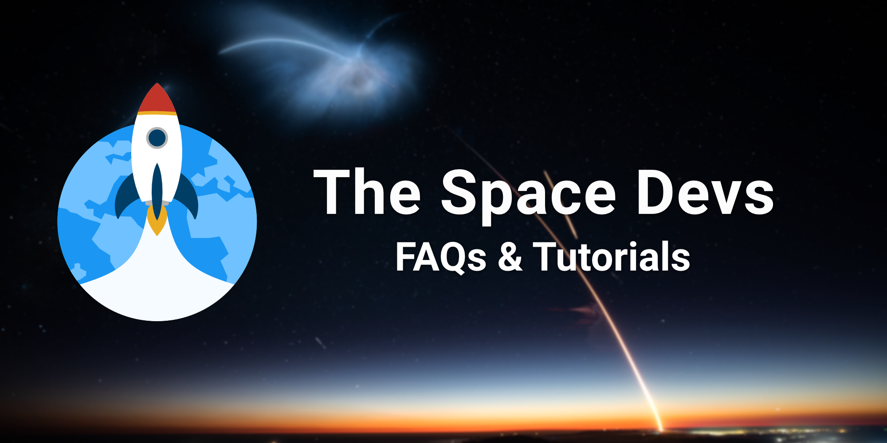

# The Space Devs - FAQs & Tutorials

This repository contains FAQs (Frequently Asked Questions) related to The Space Devs, our Launch Library 2 and
Spaceflight News APIs as well as tutorials to help get you started with your project.

If you have any question, feedback, or want to interact with the staff and community, join our [Discord server](https://discord.gg/p7ntkNA).

## Table of Contents

<!-- Start TOC (do not remove me) -->

* Frequently Asked Questions (FAQs)
  * [The Space Devs](faqs/faq_TSD.md)
  * [Launch Library 2](faqs/faq_LL2.md)
  * [Spaceflight News API](faqs/faq_SNAPI.md)
* Tutorials
  * Getting started
    * [Launch Library 2](tutorials/getting_started_LL2.md)
    * [Spaceflight News API](tutorials/getting_started_SNAPI.md)
  * Process and visualize data
    * [Coming soon™] Process and make statistics with LL2 data
    * [Coming soon™] Process and visualize launch telemetry with LDAPI
  * Develop basic services
    * [Coming soon™] Create a Discord bot that uses LL2 and SNAPI
    * [Coming soon™] Create an iOS app that uses LL2 and SNAPI
    * [Coming soon™] Use OpenAPI Generator with LL2
  

<!-- End TOC (do not remove me) -->
