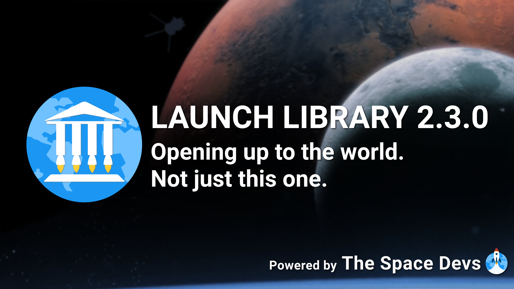

# Launch Library 2.3.0 Release

## Table of Contents

<!-- Start TOC (do not remove me) -->

* [Context](#-context)
* [Highlights](#-highlights)
* [Frequently Asked Questions (FAQs)](#-frequently-asked-questions-faqs)
* [Full changelog](#-full-changelog)

## 📢 Context

> Here is some history and context for this release. If you don't care (which is perfectly OK), feel free to [skip this
> section entirely](#-highlights) 😄 Happy reading! ~[Arnaud](https://github.com/Nosudrum)

### 📜 How we got here

The initial release of Launch Library 2.0.0 was made public in july 2020. Since then, two other versions have been
released to implement small changes that required breaking changes in the API schema.

- 2.1.0 was released in november 2020 with some field type changes, a few new filters, new config endpoints, and a
  new launch status (TBC);
- 2.2.0 was released in february 2021, with docs fixes, throttle bypasses, and some new & removed fields.

Since february 2021, many new features have been added to version 2.2.0, as they did not break the API schema: mission
patches, webcast automation, automated stats, comma-separated filters, spacecraft landings, T-0 precision, spacewalks,
launch timelines, and many more smaller improvements.

This means that since 2021, all ideas requiring breaking changes to the API schema (i.e. a version bump) piled up
while we worked on improving 2.2.0. In late 2022, we started keeping track with GitHub issues of every single change we
wanted to see in the next LL2 version. By early 2024, we had completed all the development work for 2.2.0 features.

### 💻 Version 2.3.0 development work

Before diving head first into all the piled up issues, we held two dev team meetings to go over every issue and plan how
we would tackle the breaking database and API changes while ensuring full backwards compatibility with previous API
versions.

That being done, we started working on version 2.3.0 on february 11. Some 100+ issues and 200+ pull
requests later, Launch Library version 2.3.0 is ready.

User-facing changes aside, this release is a **major** step-up in code maintainability. All endpoints have
undergone major refactoring work, and so have the tests which now cover all fields of all 2.3.0 endpoints. A lot of
work also went into improving the human documentation, making the schema 100% accurate for client generation, and
optimizing database queries for performance.

**TL;DR - we really worked hard on this.**

### 🙏 Acknowledgements

Special thanks go to [Lucas](https://github.com/lucas-stauder), who contributed significantly to this effort, as
well as [Jacques](https://github.com/JRascagneres) and [Caleb](https://github.com/ItsCalebJones), who were essential in
tackling the more intricate and infrastructure-related tasks.

And of course, a big shoutout as well to [our Patrons](https://thespacedevs.com/supportus) who make this project
**possible** and **sustainable**. 🤍

## ✨ Highlights

- 🤖 **Launch designator automation**
    - Moved from the `mission` object to the `launch` object, the `launch_designator` field is now fully automated for
      all previous launches.
    - This
      allows [querying LL2 launches using COSPAR IDs](https://ll.thespacedevs.com/2.3.0/launches/?launch_designator=1957-001,2021-123),
      and effortlessly expanding LL2 data with other sources (e.g.
      live object status & orbital elements from [Celestrak](https://celestrak.org/satcat/records.php?INTDES=2024-047))
- 📸 **Rework of images as reusable objects**
    - The `image_url`, `profile_url`, `logo_url`, etc. fields have been reworked to link to a new `Image` object that
      can be reused to allow for better caching and crediting.
    - This object has crediting & license information, as well as a ready to use thumbnail and, when relevant, multiple
      related `ImageVariant` objects (e.g. various versions of a logo)
- 🚀 **New launch status**
    - The `Payload Deployed` (ID 9) launch status has been added as an intermediate status before confirmation of
      payload AOS.
    - It is returned as `In Flight` (ID 6) in 2.2.0 and older versions.
- 🪐 **Celestial bodies**
    - A new `CelestialBody` object has been created for `Orbit`, `Location`, and `LandingLocation` objects, as well as
      filtering options on relevant endpoints.
    - ⚠️ **This means 2.3.0 can now include launches from other bodies than Earth.** These are hidden in 2.2.0 and
      previous versions.
- 🏳️ **Countries**
    - All the country & nationality information has been reworked to use one or multiple linked `Country` objects.
    - This new object includes all the information needed to collect relevant metadata (e.g. flags) from other sources,
      or to accurately display one or multiple nationalities.
- 🛰️ **Payloads**
    - *While the idea remains not to transform LL2 into an exhaustive SATCAT*, new `Payload`, `PayloadFlight` objects
      allow the addition of uncrewed & non-reusable space objects to rockets in a similar fashion as the
      existing `Spacecraft` objects.
    - This makes it possible to provide a broader coverage (e.g. with dockings, landings, etc.) for high-profile
      missions.
    - For exhaustive (but perhaps less detailed) payload information, the `launch_designator` automation allows easy
      expansion with data from other sources.
- ⚙️ **Multiple spacecraft per rocket & dockings rework**
    - `Rocket` objects can now have *multiple* `SpacecraftFlight` (& `PayloadFlight`) objects, to support some edge
      cases (e.g. Apollo CSM & LEM)
    - Dockings have been reworked to be possible between any two `SpacecraftFlight`, `PayloadFlight`, and `SpaceStation`
      objects, to support all space dockings.
- ⚡ **Performance**
    - Significant effort has been made to optimize serializers and database queries for performance.
    - This should™️ mean the end of server timeouts when querying large amounts of data at once, despite the increased
      complexity of 2.3.0 responses.

## ❓ Frequently Asked Questions (FAQs)

Ok maybe not *frequently*, but these are questions we expect so here are immediate answers.

> ### Why is a new version needed?

A new API version is needed to implement breaking changes in the schema (e.g. field type changes or removals).
Feature and data structure rework ideas requiring breaking changes have piled up over multiple years, so they could all
be bundled into a massive new API version. This is LL 2.3.0.

> ### Will older version keep working?

Yes. All older versions remain functional as full backwards compatibility has been implemented.

> ### Do I need to migrate?

Not necessarily, but it is recommended.

> ### Will older versions remain supported?

Bugs reported in older versions will be fixed as long as they do not impact the latest version.
Questions related to older versions will continue to be answered to the best of our abilities.

> ### Will older versions get any new features?

No.

## 🧵 Full changelog

> ### Acronyms
> - `FK` means `Foreign Key`, which creates a single relation from one object to another (reusable) one. For example,
    the `Location` FK in the `Pad` model. One pad can only be linked to one location, but one location is often linked
    to multiple pads.
> - `M2M` means `Many-To-Many`, which creates relations from one object to multiple other ones. For example,
    the `AstronautFlight` M2M in the `Spacewalk` model, for linking multiple crew members to a single spacewalk object.

### 🆕 New models

- added the `CelestialBody` model (+ `CelestialBodyType` config), used as FK in the `Location`, `LandingLocation`,
  and `Orbit` models
- added the `Country` config to replace string-based information in the `Agency`, `Astronaut`, `Location`, and `Pad`
  models
- added the `Image` and `ImageVariant` models (+ `ImageLicense` and `ImageVariantType` configs), used as FK in place of
  almost all previous `image_url`, `profile_url`, `logo_url`, etc. fields across many models
- added the `LauncherConfigurationFamily` model, used as M2M in the `LauncherConfiguration` model
- added the `Payload` and `PayloadFlight` models (+ `PayloadType` config)
- added the `ProgramType` config, used as FK in the `Program` model
- added the `SocialMediaLink` model (+ `SocialMedia` config), used as M2M in the `Astronaut`  and `Agency` models
- added the `SpacecraftConfigurationFamily` model, used as M2M in the `SpacecraftConfiguration` model
- added the `SpacecraftConfigurationType` config, used as FK in the `SpacecraftConfiguration` model

### 🆕 New fields on existing models

- added the `active` and `image` fields to `Location` and `Pad` models
- added the `duration` and `turn_around_time` duration fields to the `SpacecraftFlight` model
- added the `fastest_turnaround` duration fields to the `Pad`, `Launcher`, `LauncherConfiguration`, `Spacecraft`,
  and `SpacecraftConfiguration` models
- added the `geo_capacity` and `sso_capacity` fields to the `LauncherConfiguration` model
- added the `is_placeholder` field to the `Launcher` model
- added the `is_placeholder` field to the `LauncherConfig` model (for cases where the exact variant is not
  known yet, e.g. a generic Vulcan Centaur or Ariane 6)
- added the `live` boolean field to the `VidURL` model, and automated it
- added payload and spacecraft landing statistics to the `Agency` model
- added stats to the `SpacecraftConfiguration` model
- added the `astronauts` field to the `Event` model
- added the `attempted_landings` and `failed_landings` fields to the `LandingLocation` model

### 🔀 Field/filter renaming & reorganization

- combined the functionality of comma-separated `lsp__ids` and the single `lsp__id` filters into `lsp__id`
- moved the `launch_designator` field (unpopulated before 2.3.0) from the `Mission` model to the `Launch` model, and
  automated it
- renamed the `docked` field in the `SpaceStation` model to `currently_docked`
- renamed the `infoURLs` and `vidURLs` fields in the `Launch` model to `info_urls` and `vid_urls`
- renamed the `location` field in the `Landing` model to `landing_location`
- renamed the `manufacturer` filter on the `SpacecraftConfiguration` endpoint to `agency`, to match the filtering field
- renamed the `nation_url` field in the `Agency` model to `social_icon`

### ⚙️ Type & format changes

- made the `apogee`, `gto_capacity` `launch_mass`, `leo_capacity`, and `to_thrust` fields floats in the
  `LauncherConfiguration` model
- made the `family` field in the `LauncherConfiguration` model a FK to the new `LauncherConfigurationFamily` config
- made the `founding_year` field an integer in the `Agency` model
- made the `latitude` and `longitude` fields floats in the `Location` and `Pad` models
- made the `launch_cost` field an integer in the `LauncherConfiguration` model
- made the `spacecraft_stage` field in the `Rocket` model an M2M relation to the `SpacecraftFlight` model
- made the `status`, `net`, `window_start` and `window_end` fields non-nullable in the `Launch` model
- made the `status` field in the `Launcher` model a `LauncherStatus` FK, and added filtering by FK ID on the endpoint
- made the `type` field in the `Agency` model a FK to the `AgencyType` config
- replaced the `agency_id` field in the `Pad` model with an M2M relation to the `Agency` model
- replaced the `turn_around_time_days` integer field in the `FirstStage` model by an
  ISO8601-formatted `turn_around_time`
  duration field
- reworked the `DockingEvent` model to make it work with a chaser and a target, both of which can be
  a `Spacecraft`, `SpaceStation`, or `Payload` FK
- reworked the `DockingLocation` model to make it have both a `Spacecraft` FK and a `Payload` FK

### 🗑️ Field removals

- removed the `holdreason` field from the `Launch` model
- removed the `launch_library_url` fields from all models where it was still present (remains from the LL1 era)
- removed the `news_url` and `video_url` fields from the `Event` model (replaced by `InfoURL` and `VidURL`
  M2Ms like for launches, as introduced in 2.2.0)
- removed the `r_spacex_api_id` field from the `Launch` model and the associated filter on the endpoint (API deprecated)
- removed the `the nation_url` field from the `SpacecraftConfiguration` model
- removed the `twitter` and `instagram` fields from the `Astronaut` model
- removed the `vehicle_range` field from the `LauncherConfiguration` model

### 🚀 Misc

- added the `Payload Deployed` (ID 9) launch status, returned as `In Flight` (ID 6) in older versions
- added `webcast_live` automation for NASA+ URLs in `VidURL` objects

### 📈 API & endpoint enhancements

- added admin panel validations to prevent common human errors (e.g. multiple librarians editing something at the same
  time)
- automated the endpoint docs to provide fully exhaustive filtering, sorting, ordering, and generic information
- major refactor of all serializers to clean up code and allow full tests coverage, this means some fields might have
  been added/removed to/from the `list` and `normal` modes
- major refactor of all endpoints to ensure polymorphism is properly documented in the schema
- removed the non-strict LSP & location filtering option from the `Launch` endpoint that prevented proper filter
  documentation
- renamed all endpoint URLs to use plural and `snake_case`
- significant database-related performance improvements on all endpoints
