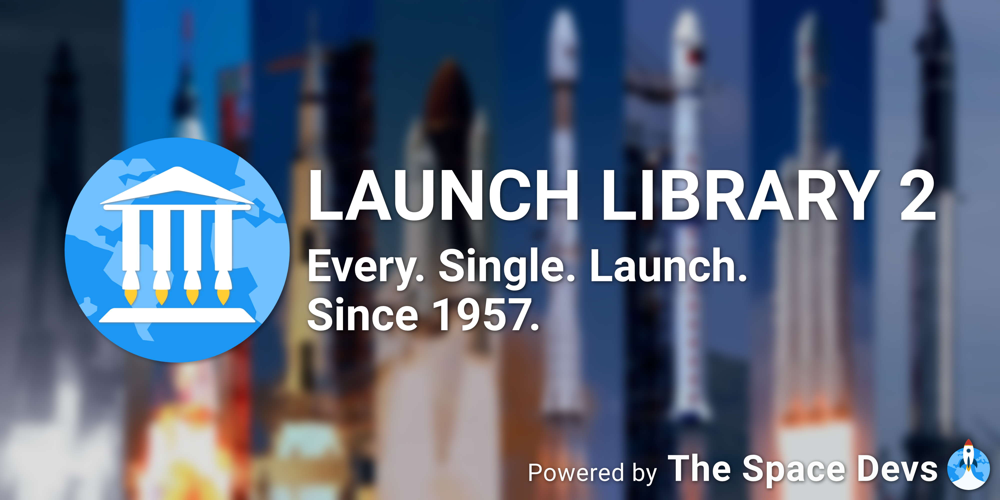

# Launch Library 2 - Frequently Asked Questions (FAQ)

## Table of Contents

<!-- Start TOC (do not remove me) -->

* [About](#about)
* [APIs](#apis)
    * [Which APIs are available?](#which-apis-are-available)
* [Partners](#partners)
* [Users](#users)
* [Staff](#staff)
* [Contact](#contact)
* [Free and paid access](#free-and-paid-access)
  * [What is lldev?](#what-is-lldev)
  * [Do I need an API key?](#do-i-need-an-api-key)
  * [How do I get an API key?](#how-do-i-get-an-api-key)
  * [How do I use my API key?](#how-do-i-use-my-api-key)
  * [How do I change my API key?](#how-do-i-change-my-api-key)

## Data

> ### Where does LL2 data come from?

## Free and paid access

> ### What is lldev?

> ### Do I need an API key?

> ### How do I get an API key?

To get an API key, choose the tier that satisfies your needs on our [Patreon](https://www.patreon.com/TheSpaceDevs) and
head over to our [website](https://thespacedevs.com/supportus) to generate your key.

> ### How do I use my API key?

> ### How do I change my API key?

## Endpoints

> ### Why does past launch/event still appears in the upcoming endpoint ?

## Status

> ### Is Launch Library 2 down ?
